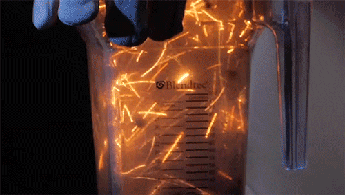

<!--
_paginate: false
_footer: ""
-->
<style scoped>
h1,h2 {
  text-align: center;
}
h1 {
  color: black;
  text-decoration: underline;
  font-size: 3em;
}
h2 {
  color: black;
  font-size: 2em;
}
img {
    vertical-align: middle;
}
</style>

# First Class Functions!
## _What can't they do?_
## Carson Anderson - Weave
##  carsonoid &nbsp;&nbsp;&nbsp;&nbsp;&nbsp;  carson_ops

---

<style scoped>
h1,p {
    font-size: 2em;
    text-align: center;
}
</style>


# First class? What does that even mean?

Define It - Create It - Delete It
Receive It - Return It - Share it

---

# Most of Go is first class

```golang
import (
    "fmt"
)

var hello = "Hello!"           // <- built-in

func printMsg(msg string) {    // <- function
    fmt.Println(msg)
}

type Greeter interface{        // <- interface
    SayHello()
}

type Printer struct{           // <- struct
    Name string                // <- member
}

func (p *Printer) SayHello() { // <- method
    printMsg(hello)
}
```

---

# Anatomy of a Function

```golang
func NAME(ARGUMENTS) RETURNS {
    // CODE
}

func getString() string { //...

func riskyGet() (string, error) { //...

func getNames() (firstName string, lastName string) { //...

func putString(s string){ //...

func putStrings(s1, s2 string){ //...

func getAndPutString(s string) string { //...
```

---

<style scoped>
pre {
    font-size: 1.5em;
}
h1 {
    font-size: 2em;
}
</style>

# The Important Part

```golang
func NAME(ARGUMENTS) RETURNS { // ...
```

## Would have a _signature_ of...

```golang
func(ARGUMENTS) RETURNS
```
---

<style scoped>
h1,h2 {
  text-align: center;
  color: black;
  text-shadow: 0 0 2px white, 0 0 30px white, 0 0 40px white, 0 0 50px white, 0 0 60px white, 0 0 80px white;
  font-size: 3em;
  position: fixed;
  left: 50%;
  transform: translate(-50%, -50%);
}

h1{
    top: 1em;
}

h2 {
  top: 3em;
  font-size: 2em;
}
</style>

# Part One

## Let's Go First Class!


---

# The Basics of First Class Functions

```go
func getMessage() string {
    return "Hello"
}

func getPrinter() func(string) {
    p := func(msg string){
        fmt.Println(msg)
    }
    return p
}

func printWith(p func(string), msg string) {
    p(msg)
}

func main() {
    m := getMessage() // m == string
    p := getPrinter() // p == func(string)
    printWith(p, m)
}
```

---


### Playground: https://play.golang.org/p/L685ssySayE

<iframe width="100%" height="100%" frameborder="0" src="https://play.golang.org/p/L685ssySayE">
</iframe>

---

# Assigned and Anonymous

```go
func printWith(p func(string), msg string) {
    p(msg)
}

func main() {
    pfunc := func(msg string) { fmt.Println(msg) }
    printWith(pfunc, "Printed with an anonymous function assigned to a variable")

    printWith(
        func(msg string) {
            fmt.Println(msg)
        },
        "Printed with an anonymous function without assignment",
    )
}
```

---

### Playground: https://play.golang.org/p/IHfwlD5xI8I

<iframe width="100%" height="100%" frameborder="0" src="https://play.golang.org/p/IHfwlD5xI8I">
</iframe>

---

# Function Without Types

```golang
func printWith(p func(string), msg string) {
    p(msg)
}

func printMsg(msg string){
    fmt.Println(msg)
}

func main() {
    printWith(printMsg, "We don't need explicit function types")
}
```

---

# Functions With Types

```golang
type PrintFunc func(string)

func printWith(p PrintFunc, msg string) {
    p(msg)
}

func printMsg(msg string){
    fmt.Println(msg)
}

func main() {
    printWith(printMsg, "But they do make things cleaner")
}
```
---

# The Basics: Now With Types!

```go
type PrintFunc func(string)

func getPrinter() PrintFunc {
    p := func(msg string){
        fmt.Println(msg)
    }
    return p
}

func printWith(p PrintFunc, msg string) {
    p(msg)
}

func main() {
    p := getPrinter()
    printWith(p, "I just used first class functions twice!")
}
```

---

### Playground: https://play.golang.org/p/IsoXtQ5FpvL

<iframe width="100%" height="100%" frameborder="0" src="https://play.golang.org/p/IsoXtQ5FpvL">
</iframe>

---

<style scoped>
h1 {
    font-size: 2.5em;
}
li {
    font-size: 2em;
}
</style>


# When Do I Use Function Types?

- Complex signatures
- Reused signatures

---

# Before Types

```golang
func GetInputFunc() func(string, int, ...map[int]float64) {
    // ...
}

func RunContrivedExample(f func(string, int, ...map[int]float64), enable bool) (bool, func() error, error) {
    // ...
}
```

---

# After Types

```golang
type InputFunc func(string, int, ...map[int]float64)

type OutputFunc func() error

func GetInputFunc() InputFunc {
    // ...
}

func RunContrivedExample(f InputFunc, enable bool) (bool, OutputFunc, error) {
    // ...
}
```

---

# __Part Two__

# Will it Function?



---

<style scoped>
pre {
    font-size: 1.5em;
}
h1 {
    font-size: 2em;
}
</style>

# Can A Function Receive A Function?

```golang
//            ▼ func()?
func handle(x string) {
    // ...
}
```

---
<!-- _class: yesyoucan -->

## Yes It Can!

```golang
type PrintFunc func(string)

func callPrinters(msg string, p1, p2 PrintFunc) {
    p1("p1 says: " + msg)
    p2("p2 says: " + msg)
}

func main() {
    printerOne := func(msg string) { fmt.Println(msg) }
    callPrinters(
        "Hello",
        printerOne,
        func(msg string) { fmt.Println(msg) },
    )
}
```

---

### Playground: https://play.golang.org/p/Tf6kUSu4VjQ

<iframe width="100%" height="100%" frameborder="0" src="https://play.golang.org/p/Tf6kUSu4VjQ">
</iframe>

---

# Real World Example: net/http

```golang
import (
    "fmt"
    "net/http"
)

// hello matches the http.HandlerFunc signature of
// func(http.ResponseWriter, *http.Request)
func hello(w http.ResponseWriter, req *http.Request) {
    fmt.Fprintf(w, "hello\n")
}

func main() {
    http.HandleFunc("/hello", hello)
    http.ListenAndServe(":8080", nil)
}
```

---

<style scoped>
pre {
    font-size: 1.5em;
}
h1 {
    font-size: 2em;
}
</style>


# Can A Function Return A Function?


```golang
//         ▼ func()?
func get() string {
    // ...
}
```

---
<!-- _class: yesyoucan -->

## Yes It Can!

```golang
type PrintFunc func(string)

func getPrinter() PrintFunc {
    return func(msg string) {
        fmt.Println(msg)
    }
}

func main() {
    p := getPrinter()
    p("Hello from the function returned by getPrinter")
}
```

---

# Real World Example: Context

```golang
import (
    "context"
    "database/sql"
    "fmt"
    "time"
)

func main() {
    // setup not shown

    // context.WithCancel signature:
    // WithCancel(parent Context) (ctx Context, cancel CancelFunc)
    ctx, cancel := context.WithCancel(context.Background())
    
    go func(){
        rows, err := db.QueryContext(ctx, "SELECT name FROM users")
        fmt.Println(rows)
    }()

    time.Sleep(time.Second)
    cancel()
}
```

---

# Can A Function Return A Function?
## Which returns a function?
### and on and on...

----
<!-- _class: yesyoucan -->

## Yes It Can!

```golang
type PrintFunc func(string)

func getPrinterMaker() func() PrintFunc {
    return func() PrintFunc {
        fmt.Printf("Making new printer: ")
        return func(msg string) {
            fmt.Println(msg)
        }
    }
}

func main() {
    makePrinter := getPrinterMaker()

    for i := 0; i < 3; i++ {
        p := makePrinter()
        time.Sleep(time.Second)
        p("Hello from a newly-generated printer")
        time.Sleep(time.Second)
    }
}
```

---

### Playground: https://play.golang.org/p/7VHYXH3sQVS

<iframe width="100%" height="100%" frameborder="0" src="https://play.golang.org/p/7VHYXH3sQVS">
</iframe>

---

<style scoped>
pre {
    font-size: 1.5em;
}
h1 {
    font-size: 1.75em;
}
</style>


# Can A Struct Have A Function As A Member?


```golang
type Person struct {
    //    ▼ func()?
    name: string
}
```

---
<!-- _class: yesyoucan -->

## Yes It Can!

```golang
type PrintFunc func(string)

type MultiPrinter struct {
    DynamicPrint PrintFunc
}

func (mp *MultiPrinter) Print(msg string) {
    fmt.Println(msg)
}

func main() {
    mp := MultiPrinter{
        DynamicPrint: func(msg string) { fmt.Println(msg) },
    }

    mp.Print("Hello from a method!")

    mp.DynamicPrint("Hello from a member function")

    mp.DynamicPrint = func(msg string) {
        fmt.Println(time.Now(), "|", msg)
    }

    mp.DynamicPrint("Hello from a member function")
}
```

---

### Playground: https://play.golang.org/p/J5g728CTmIx

<iframe width="100%" height="100%" frameborder="0" src="https://play.golang.org/p/J5g728CTmIx">
</iframe>

---

<style scoped>
pre {
    font-size: 1.5em;
}
h1 {
    font-size: 1.75em;
}
</style>


# Can You Have A Map With Function Values?


```golang
//               ▼ func()?
var m map[string]string
```

---

<!-- _class: yesyoucan -->

## Yes You Can!

```golang
// PrintFunc is any function or method that takes a string
type PrintFunc func(string)

func main() {
    printerMap := map[string]PrintFunc{
        "printerOne": func(msg string) { fmt.Println(msg) },
        "printerTwo": func(msg string) { fmt.Println(msg) },
    }

    printerMap["printerOne"]("Hello")
    printerMap["printerTwo"]("Howdy")

    printerMap["lazyPrinter"] = printerMap["printerOne"]
    printerMap["lazyPrinter"]("Hi")

    fmt.Println("\nRoll call:")
    for name, print := range printerMap {
        print(name + " is standing by")
    }
}
```

---

### Playground: https://play.golang.org/p/_mmbDsgiRCX

<iframe width="100%" height="100%" frameborder="0" src="https://play.golang.org/p/_mmbDsgiRCX">
</iframe>

---

# Real World Example: Templates

```golang
var simple = "blue is {{ blue }} and red is {{ red }}"

func main() {
    fm := template.FuncMap{
        "blue": func() string { return "#0000FF" },
        "red":  func() string { return "#FF0000" },
    }

    // template.FuncMap signature:
    // type FuncMap map[string]interface{}
    tmpl, _ := template.New("hello").Funcs(fm).Parse(simple)

    tmpl.Execute(os.Stdout, nil)
}
```

---

### Playground: https://play.golang.org/p/rf9mzE2kJlL

<iframe width="100%" height="100%" frameborder="0" src="https://play.golang.org/p/rf9mzE2kJlL">
</iframe>

---

<style scoped>
pre {
    font-size: 1.5em;
}
h1 {
    font-size: 1.75em;
}
</style>


# Can You Have A Map With Function Keys?

```golang
//        ▼ func()?
var m map[string]string
```

---


# Nope!

## Keys Have To Be Comparables:

- `bool`
- `string`
- any `int`
- any `float`
- `struct` _(sometimes)_

---

<style scoped>
pre {
    font-size: 1.5em;
}
h1 {
    font-size: 2em;
}
</style>

# Can You Have A Slice Of Functions?

```golang
//      ▼ func()?
var s []string
```
---
<!-- _class: yesyoucan -->

## Yes You Can!

```golang
type ModifyFunc func(string) string

func main() {
    modifyFuncs := []ModifyFunc{
        func(msg string) string { return msg + " is cool" },
        func(msg string) string { return strings.Title(msg) },
    }

    exclaimString := func(msg string) string {
        return msg + "!"
    }

    modifyFuncs = append(modifyFuncs, exclaimString)

    name := "carson"
    for _, modify := range modifyFuncs {
        fmt.Println(name)
        name = modify(name)
    }
    fmt.Println(name)
}
```

---

### Playground: https://play.golang.org/p/3aiXT4fleuM

<iframe width="100%" height="100%" frameborder="0" src="https://play.golang.org/p/3aiXT4fleuM">
</iframe>

---

<style scoped>
pre {
    font-size: 1.5em;
}
h1 {
    font-size: 2em;
}
</style>


# Can You Have A Channel Of Functions?

```golang
//             ▼ func()?
c := make(chan string, 1)
c <- "test"
fmt.Println(<-c)
```

---
<!-- _class: yesyoucan -->

## Yes You Can!

```golang
type PrintFunc func(string)

func main() {
    // Make a channel that can buffer one print func at a time
    printerChan := make(chan PrintFunc, 1)

    // Create a function and assign it to the variable "printerOne"
    printerOne := func(msg string) { fmt.Println("printerOne says:", msg) }

    // Send the function variable to the channel
    printerChan <- printerOne

    // Get the printer function off the channel and use it
    p := <-printerChan
    p("Hello")

    // Send a function to the channel without assigning it.
    printerChan <- func(msg string) { fmt.Println("printerTwo says:", msg) }

    // Get and print without assigment
    (<-printerChan)("Howdy")
}
```

---

<style scoped>
pre {
    font-size: 1.5em;
}
h1 {
    font-size: 2em;
}
</style>


# Can A Function Have State?

```golang
type Printer struct {
    data []string
}

//    ▼ this doesn't count
func (p *Printer) print() {
    fmt.Println(p.data)
}
```

---
<!-- _class: yesyoucan -->

## Yes It Can! (Closure)

```golang
type PrintFunc func(string)

func newStatefulPrinter() PrintFunc {
    data := []string{}
    return func(msg string) {
        data = append(data, msg)
        fmt.Println(strings.Join(data, " "))
    }
}

func main() {
    sayAndRemember := newStatefulPrinter()
    sayAndRemember("Hello")
    sayAndRemember("I have")
    sayAndRemember("state!")

    sayAndRemember = newStatefulPrinter()
    sayAndRemember("I'm new")
    sayAndRemember("and have")
    sayAndRemember("new state!")
}
```

---

### Playground: https://play.golang.org/p/1JLUIpSo7RH

<iframe width="100%" height="100%" frameborder="0" src="https://play.golang.org/p/1JLUIpSo7RH">
</iframe>

---

<style scoped>
pre {
    font-size: 1.5em;
}
h1 {
    font-size: 2em;
}
</style>


# Can A Function Satisfy An Interface?

```golang
type Greeter interface {
    SayHello()
}

//           ▼ func()?
type Printer struct {}

func (p *Printer) SayHello() {
    fmt.Println("hello")
}
```

---
<!-- _class: yesyoucan -->

## Yes It Can!

```golang
type Greeter interface {
    SayHello()
}

// PrintFunc is any function or method that takes a string
type PrintFunc func(string)

// PrintFunc implements the Greeter interface
func (pf PrintFunc) SayHello() {
    pf("Hello from a function")
    fmt.Println("Hello from a method of the function")
}

func main() {
    p := func(msg string) {
        fmt.Println(msg)
    }
    pf := PrintFunc(p)
    pf.SayHello()
}
```

---

### Playground: https://play.golang.org/p/wfM9TLRnkoA

<iframe width="100%" height="100%" frameborder="0" src="https://play.golang.org/p/wfM9TLRnkoA">
</iframe>

---

# Real World Example: Functional Arguments

## Before

```golang
s := NewService("http", true, "127.0.0.0:8080", 10, time.Second*3)
```

## After

```golang
s := NewService("http",
    WithEnabled,
    WithListener("127.0.0.0:8080"),
    WithRetries(10),
    WithTimeout(time.Second*3),
)
```

---

### Before | Playground: https://play.golang.org/p/7lif9CwAqPe

<iframe width="100%" height="100%" frameborder="0" src="https://play.golang.org/p/7lif9CwAqPe">
</iframe>

---

### After | Playground: https://play.golang.org/p/raE5w2_gb2x

<iframe width="100%" height="100%" frameborder="0" src="https://play.golang.org/p/raE5w2_gb2x">
</iframe>

---

<style scoped>
h1, h2, h3{
    text-align: center;
}
</style>


# __Do not fear first class functions__
# Dave Cheney


https://dave.cheney.net/2016/11/13/do-not-fear-first-class-functions

---

<style scoped>
p{
    font-size: 1.5em;
    display: flex;
    flex-wrap: nowrap;
}
p,h1,h2,h3{
    text-align: center;
    white-space: nowrap;
}
h1{
    font-size:2em;
}
</style>


# __Next From Me:__

# GoWest: May 7-8

## "All Types Of Golang Types"


https://www.gowestconf.com

---
<!--
_paginate: false
_footer: ""
-->

<style scoped>
h1,h2,h3 {
  text-align: center;
}
h1 {
  color: black;
  text-decoration: underline;
  font-size: 3em;
}
h2 {
  color: black;
  font-size: 2em;
}
h3 {
  color: black;
  font-size: 1.5em;
}
</style>

# Questions?
## Carson Anderson - Weave
##  carsonoid &nbsp;&nbsp;&nbsp;&nbsp;&nbsp;  carson_ops
## Markdown To Slides: https://marp.app
### https://github.com/carsonoid/talk-first-class-functions-in-go
